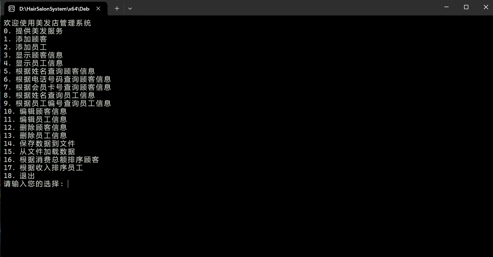
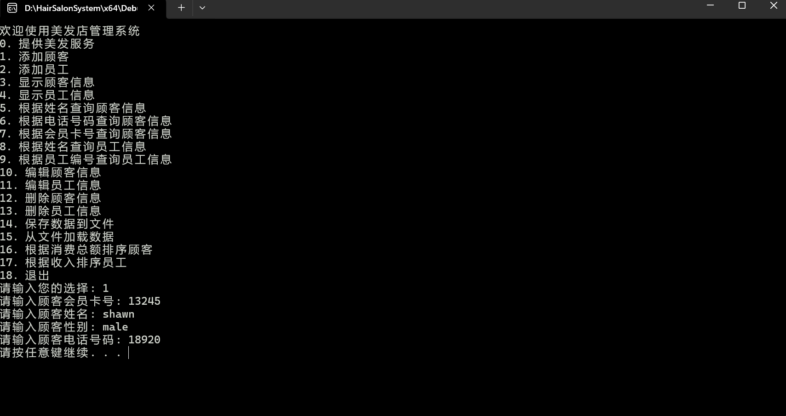
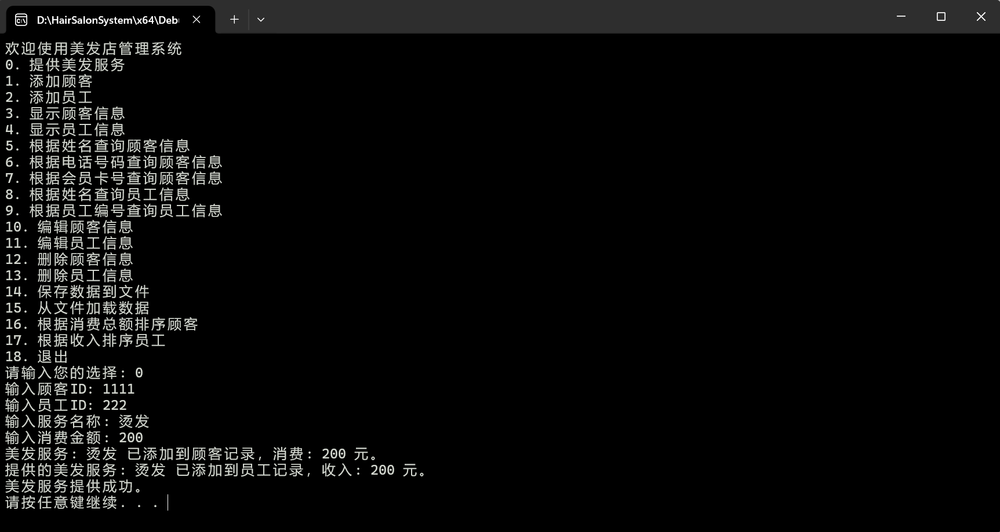
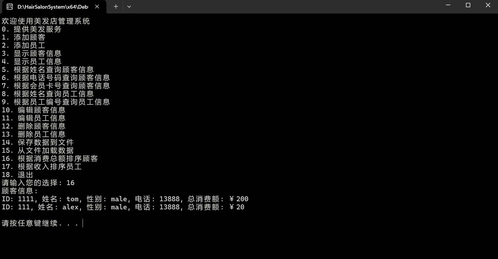

<<<<<<< HEAD
\# HairSalonSystem - 美发店管理系统 (C++课程设计)

一个基于 C++ 的美发店会员与员工管理系统，支持顾客信息管理、员工绩效统计、服务记录、消费/收入自动累计、文件持久化等完整功能。

\## 项目亮点

\- 完整面向对象设计（继承、多态、虚函数）

\- 使用 STL（vector、algorithm、fstream、lambda）实现高效数据操作

\- 支持文件持久化与数据一致性（ID唯一性校验、边界情况处理）

\- 菜单驱动交互界面，易于使用与测试

\## 技术栈

\- C++17

\- STL（vector、algorithm、fstream、find\_if、sort、lambda）

\- 面向对象编程（OOP）：继承、多态、虚函数重写

\- 文件 I/O 持久化（读写二进制/文本数据）

\- 边界处理与异常安全

\## 主要功能

\- 顾客管理：增删改查、总消费额统计

\- 员工管理：增删改查、收入统计

\- 服务记录：顾客消费 + 员工收入自动累计

\- 排序功能：按总消费额 / 收入降序排序

\- 数据持久化：保存/加载到文件，支持多次运行

\- ID唯一性校验 \& 友好提示（未找到记录、重复ID等）

\## 项目结构

HairSalonSystem/

├── main.cpp              主程序入口 + 菜单交互

├── Person.h / Person.cpp         基类（Person）

├── Customer.h / Customer.cpp     顾客派生类

├── Employee.h / Employee.cpp     员工派生类

└── HairSalon.h / HairSalon.cpp   核心管理系统类（顾客/员工容器、服务逻辑）

text## 快速开始

\### 环境要求

\- Windows / macOS / Linux

\- 编译器：支持 C++17（推荐 Visual Studio 2022 / g++ 9+）

\### 编译与运行

1\. 使用 Visual Studio 打开项目（或用 CMake / g++ 编译）

2\. 编译运行 `main.cpp`

3\. 按菜单数字选择操作（0-18）

示例操作：

\- 添加顾客：输入 1 → 按提示输入 ID、姓名、性别、电话

\- 提供服务：输入 0 → 输入顾客ID、员工ID、服务名称、价格

\- 查看排序：输入 16（按消费排序顾客）或 17（按收入排序员工）

\## 运行效果截图

（建议添加 3-4 张截图，放在 screenshots/ 文件夹）

!\[菜单界面](screenshots/menu.png)  

!\[添加顾客](screenshots/add-customer.png)  

!\[服务记录](screenshots/service-record.png)  

!\[消费排序](screenshots/sort-by-spent.png)

\## 学习收获

\- 深入掌握 C++ 面向对象设计与 STL 高级用法

\- 理解文件持久化、数据一致性与边界情况处理

\- 培养高质量代码习惯（清晰结构、规范注释、健壮性）

欢迎 Star、Fork 或 Issue 交流！

\## License

MIT License - 详见 \[LICENSE](LICENSE) 文件

=======
# HairSalonSystem - 美发店管理系统 (C++课程设计)

一个基于 C++ 的美发店会员与员工管理系统，支持顾客信息管理、员工绩效统计、服务记录、消费/收入自动累计、文件持久化等完整功能。

## 项目亮点
- 完整面向对象设计（继承、多态、虚函数）
- 使用 STL（vector、algorithm、fstream、lambda）实现高效数据操作
- 支持文件持久化与数据一致性（ID唯一性校验、边界情况处理）
- 菜单驱动交互界面，易于使用与测试

## 技术栈
- C++17
- STL（vector、algorithm、fstream、find_if、sort、lambda）
- 面向对象编程（OOP）：继承、多态、虚函数重写
- 文件 I/O 持久化（读写二进制/文本数据）
- 边界处理与异常安全

## 主要功能
- 顾客管理：增删改查、总消费额统计
- 员工管理：增删改查、收入统计
- 服务记录：顾客消费 + 员工收入自动累计
- 排序功能：按总消费额 / 收入降序排序
- 数据持久化：保存/加载到文件，支持多次运行
- ID唯一性校验 & 友好提示（未找到记录、重复ID等）

## 项目结构
HairSalonSystem/
├── main.cpp              主程序入口 + 菜单交互
├── Person.h / Person.cpp         基类（Person）
├── Customer.h / Customer.cpp     顾客派生类
├── Employee.h / Employee.cpp     员工派生类
└── HairSalon.h / HairSalon.cpp   核心管理系统类（顾客/员工容器、服务逻辑）
text## 快速开始
### 环境要求
- Windows / macOS / Linux
- 编译器：支持 C++17（推荐 Visual Studio 2022 / g++ 9+）

### 编译与运行
1. 使用 Visual Studio 打开项目（或用 CMake / g++ 编译）
2. 编译运行 `main.cpp`
3. 按菜单数字选择操作（0-18）

示例操作：
- 添加顾客：输入 1 → 按提示输入 ID、姓名、性别、电话
- 提供服务：输入 0 → 输入顾客ID、员工ID、服务名称、价格
- 查看排序：输入 16（按消费排序顾客）或 17（按收入排序员工）

## 运行效果截图
（建议添加 3-4 张截图，放在 screenshots/ 文件夹）

  
  
  

## 学习收获
- 深入掌握 C++ 面向对象设计与 STL 高级用法
- 理解文件持久化、数据一致性与边界情况处理
- 培养高质量代码习惯（清晰结构、规范注释、健壮性）

欢迎 Star、Fork 或 Issue 交流！

## License
MIT License - 详见 [LICENSE](LICENSE) 文件
>>>>>>> 831e58f3e4569e5b7e7a715b5117525b3fd08bac
